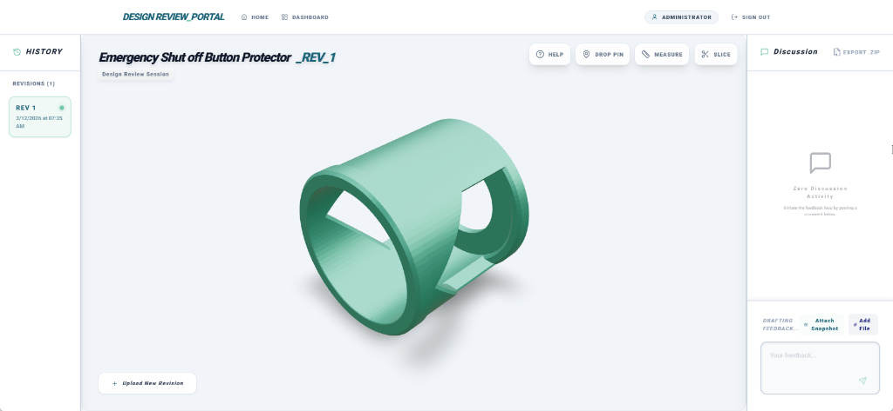

# Polyunity Design Portal

The Polyunity Design Portal is a real-time, interactive 3D STL viewer and design review platform. It enables engineers and clients to upload CAD models, track version histories, and collaborate through real-time localized comments directly pinned to the 3D geometry.



## Features
- **Real-Time 3D Rendering**: Upload and instantly visualize `.stl` design files directly in the browser.
- **Iterative Version Control**: Maintain multiple revisions of a design under a unified project framework.
- **Visual Diff Viewer**: Dynamically overlay consecutive revisions in 3D to rapidly spot changes (Additions = Green, Deletions = Red, Unchanged = Yellow).
- **Pinned 3D Feedback**: Click directly onto the 3D model to drop a pin and leave precise, localized feedback.
- **Live Server-Sent Events**: Discussion threads and version histories sync across all viewers in real-time without needing a manual refresh.
- **Snapshots & Attachments**: Attach 2D camera snapshots and reference files directly to feedback comments.
- **Data Export**: Bundle and download the complete timeline of a project via ZIP archive.

## Tech Stack
- **Framework**: Next.js 15 (App Router, Server Actions)
- **Database ORM**: Prisma (SQLite)
- **3D Engine**: Three.js (`@react-three/fiber` / `@react-three/drei`)
- **Real-Time Pipeline**: Server-Sent Events (SSE) via native API Route Handlers

---

## Deployment Instructions (Docker Compose)

The application relies heavily on Docker and Docker Compose for a simplified, sandboxed deployment. The persistent database, file uploads, and Next.js instance are contained neatly together.

### Prerequisites
- Install [Docker](https://docs.docker.com/get-docker/)
- Install [Docker Compose](https://docs.docker.com/compose/install/)
- Install [Git](https://git-scm.com/)

### 1. Initial Installation
Clone the repository to your host server:

```bash
git clone https://github.com/wyliebutler/poly_design_review.git
cd poly_design_review
```

### 2. Environment Variables
Create your primary `.env` config file by copying the example or generating the secret keys manually. For the SQLite docker deployment to work out of the box, `DATABASE_URL` should map to the Docker container's internal path.

```bash
# Example .env configuration
DATABASE_URL="file:/app/prisma/dev.db"
AUTH_SECRET="some-secure-random-string" # Essential for NextAuth
ADMIN_PASSWORD="my-secure-password" # Sets the dashboard access password
NODE_ENV="production"
```

### 3. Spin Up Docker Containers
Run the Docker Compose `up` command to build the image and launch the background containers. 

```bash
docker compose up -d --build
```
*Note: The `--build` flag forces Docker to assemble the Next.js production build before turning on the traffic listener.*

Once completed, the portal should be accessible via port `3000` on your host machine.

---

## How to Update the Application

When a new feature or bug fix has been pushed to the GitHub repository, updating the live application implies a graceful, seamless rebuild.

1. **Pull the Latest Code**
   Navigate to your local repository directory and pull the newest changes from the main branch:
   ```bash
   git pull origin main
   ```

2. **Rebuild the Docker Image**
   Restart Docker Compose with the `--build` flag. Docker will automatically turn off the old container, re-install NPM packages if needed, compile the newest Next.js assets, apply pending database Prisma migrations, and safely restart the app.
   ```bash
   docker compose up -d --build
   ```

3. **(Optional) Clean Up Disk Space**
   Docker does not unilaterally delete your old unused images when creating a new build. To free up storage space on the deployment server over time, routinely prune dangling layers:
   ```bash
   docker image prune -f
   ```
